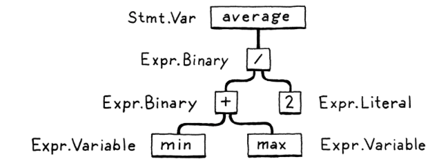

# Steps

## Initial input
`var average = (min + max) / 2`

## Scanning
Aka lexing or lexical analysis

Process of taking a linear stream of characters and chunking them together into a series of `tokens`
Examples:
- Single characters like: `(`, `,`, `.`
- Numbers: `123`
- String literals: `"hi!"`
- Identifiers: `min`

`var` `average` `=` `(` `min` `+` `max` `)` `/` `2` `;`

The rules that determine how a particular language groups characters into lexemes are called its
`lexical grammar`.

A `regular language` is a formal language that can be defined by a regular expression.
Alternatively, a regular language can be defined as a languages recognised by a `finite automaton`.

## Parsing
(Place where the language gets a grammar)
A `parser` takes a flat sequence of tokens and build a tree structure that mirros the nested
nature of the grammar.
The tree can be called many names, such as:
- Parse tree
- Abstract syntax tree
- AST

## Static Analysis
The first bit of analysis that most languages do is called `binding` or `resolution` (ex: a + b).
For each `identifier` (`a` or `b`), we find out where that name is defined and wire the 2
together. This is where `scope` comes into play, which is the region of source code where a certain
name can be used to refer to a certain declaration.

Here, we can also type check, if the language is statically typed. Now that we know where `a` and
`b` are declared, we can also figure out their types. If those types don't suport being added to
each other, we report a `type error`.

All this semantic insight that is visible to us from analysis needs to be stored somewhere:

- Often, it gets stored right back as `attribures` on the syntax tree
    these are extra fields in the nodes that aren't initialized during parsing but get filled in
    later.

- Other times, we may store data in a lookup table off to the side.
    Typically, the keys to this table are identifiers - names of variable and declarations.
    In that case, we call it a `symbol table`. And the values it associates with each key tell us
    what that identifier refers to.

## Intermediate representations
The front end -> specific to the source language the program is written in.
The back end -> concerned with the final architecture where the program will run.
The middle -> IR (intermediate representation)

IR styles:
- Control flow graph
- static single-assignment
- continuation-passing style
- three-address code (GIMPLE)
- RTL

## Optimisations

Few techniques:
- constant folding
- constant propagation
- common subexpression elimination
- loop invariant code motion
- global value numbering
- strength reduction
- scalar replacement of aggregates
- dead code elimination
- loop unrolling

## Code generation

Do we generate instruction for a real CPU of a virtual one?
Assembly vs bytecode

## Virtual machine

Needed for bytecode interpretation

## Runtime

Machine code -> Load the executable and execure
Bytecode -> Start up the VM and load the program into that.

Services we may need:
- Garbage collector to reclaim unused bits, if the language automatically manages memory
- If we support `instance of`, we need some representation to keep tack fo the type of each object
during execution.
- In go: each compiled application has its own copy of Go's runtime directly embedded in it.
- If the language is run inside an interpreter or VM, then the runtime lives there. Ex: Java,
  Python, JavaScript

# Alternative routes

## Single-pass compilers

As soon as you see some expression, you need to know enoug hto correctly compile it.

Syntax-directed translation is a technique for building these types of compilers.
    You associate an action with each piece of the grammar, usually one that generated output code.
    Then, whenever the parser matches that chunk of syntax, it executed the action, building up
    the target code one rule at at time.

## Tree-walk interpreters
Some programming languages begin executing code right after parsing it to an AST (with maybe a bit
of static analysis applied). The interpreter traverses the syntax tree one branch at a time,
evaluating each node as it goes.

Common for student projects and little languages, not widely used for general-purpose languages
since it tends to be slow.

## Transpiler

You write a front-end for your language. Then, in the back end, instead of doing all the work to
lower the semantics to some primitive target language, you produce a string of valid source code
for some other language that's about as high level as yours.

## Just-in-time compilation

You want to compile to machine code, but you might not know what architecture your end user's
machine supports.
You can take inspiration from:
- HotSpot Java Virtual Machine (JVM)
- Microsoft's Common Language Runtime (CLR)
- Most JavaScript interpreters do

On the end user's machine, when the program is loaded from source (in JS case) or
platform-independent bytecode (JVM and CLR) - you compile it to native code for the architecture
their computer supports.

Most sophisticated JIT's insert profiling hooks into the generated code to see which regions are
most performance critical and what kind of data is flowing through them. Then over time, they will
automatically recompile those hot spots with more advance optimizations. (where the HotSpot JVM)
gets its name from)

## JIT drawbacks
- Need to keep a memory cache of object code to be executed
- Startup delay because of the time it takes to load and compile bytecode

## Automatic memory management

2 main techniques for managing memory:
- reference counting
- tracing garbage collection
